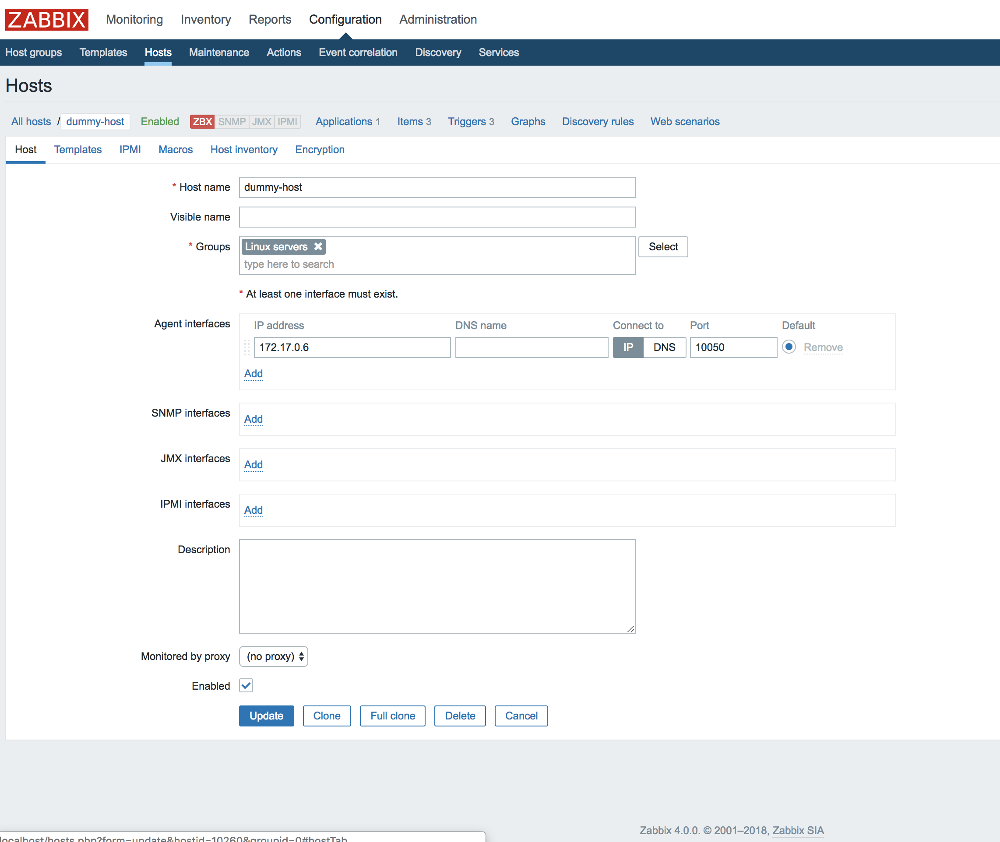
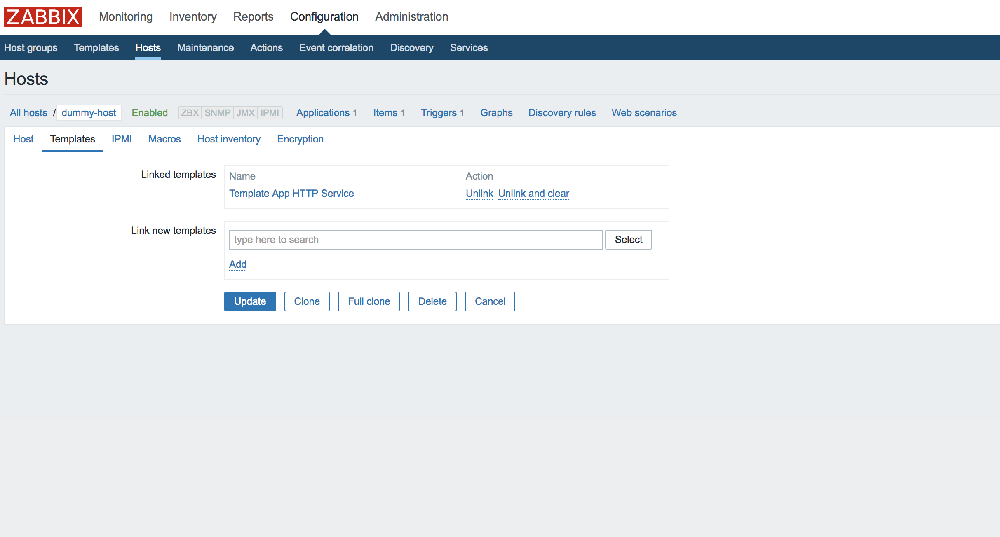
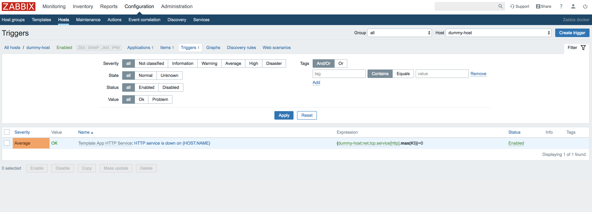

# Dev setup

### Zabbix server setup on docker
* Run `make build-zabbix-server` to spin up containers needed for Zabbix server to run on docker.
* Visit `http://localhost:80` to access Zabbix web interface. Username: `Admin`, password: `zabbix`

### Rundeck setup on docker
* Run `make build-rundeck` to spin up Rundeck container.
* Visit `http://localhost:4440/user/login` to access Rundeck web interface. Username: `admin`, password: `admin`

### Zabbix host setup on docker
* Run `make build-dummy-host` to spin up dummy Zabbix host container with Zabbix agent.
* Visit `http://localhost:8001` to access dummy host web interface.

### Add dummy host to Zabbix server for monitoring
Get the IP address of dummy host by running
```
docker inspect -f '{{range .NetworkSettings.Networks}}{{.IPAddress}}{{end}}' dummy-host
```

On [Zabbix web interface](http://localhost:80), information about configured hosts in Zabbix is available in Configuration → Hosts.
To add dummy host, click on Create host. This will present us with a host configuration form. Enter the following values.

Host name: dummy-host

Groups: Linux servers

Agent interfaces: dummy-host-IP-address-gotten-above leaving port as `10050`

Click on `Enabled` then update.



Still on Configuration → Hosts, click on `Templates`.

On the `Link new templates` field, Select `Template App HTTP Service`, click `add`, then `Update`.



### Verify dummy host set up
Still on Configuration → Hosts, click on `Triggers`.

Verify that the value of `Template App HTTP Service: HTTP service is down on {HOST.NAME}` trigger is `OK`



### Create Rundeck project
To create a [new project](https://docs.rundeck.com/docs/administration/projects/create-new-project.html) on Rundeck;
* Change the Resource Model Document Format to yaml instead of the default xml (we only support yaml in our codebase for now). Exec into the running rundeck container and update this file `/etc/rundeck/project.properties`, specifically these fields:
```
resources.source.1.config.file=/var/rundeck/projects/${project.name}/etc/resources.yaml
resources.source.1.config.format=resourceyaml
```
* Visit http://localhost:4440/resources/createProject
* Enter the project name and click create, then save, leaving the defaults.

### Container management
* Start Zabbix server containers -->  `make start-zabbix-server`
* Stop Zabbix server containers --> `make stop-zabbix-server`

* Start Rundeck containers --> `make start-rundeck`
* Stop Rundeck containers --> `make stop-rundeck`

* Start Dummy host container --> `make start-dummy-host`
* Stop Dummy host container --> `make stop-dummy-host`

* Start all containers --> `make start-all`
* Stop all containers --> `make stop-all`
